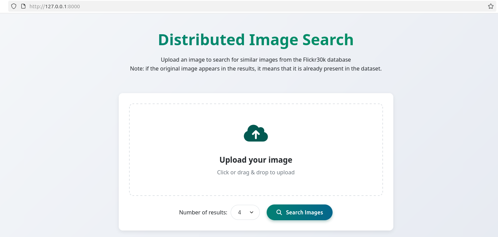
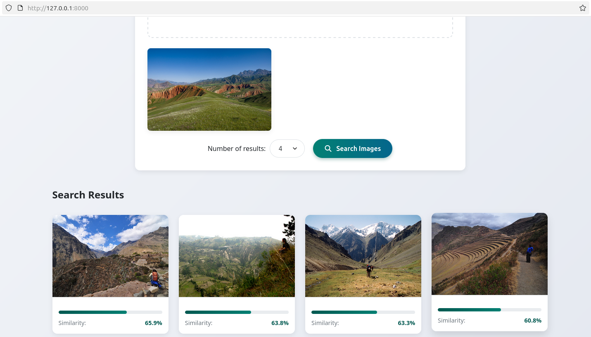

# Ricerca di immagini simili con Hadoop, Spark, PyTorch e Milvus

Questo progetto realizza un motore di ricerca per immagini su un database distribuito, sfruttando tecniche di image embedding e un database vettoriale (Milvus) per l’indicizzazione e la ricerca per similarità.

---

## Architettura del Progetto

- **Hadoop** su cluster a 2 VM (1 master `namenode` e  1 worker `datanode1`)
- **Spark 3.5.6** per il calcolo distribuito e l'archiviazione delle immagini su HDFS
- **PyTorch** per il calcolo degli embedding 
- **Milvus** come database vettoriale per l’indicizzazione e la ricerca
- **FastAPI** come backend per l’esposizione delle API

---

## Configurazione Cluster
Di seguito sono descritti tutti i passaggi necessari alla configurazione delle due macchine per operare con le tecnologie sopra citate.

### Hadoop
- Sistema operativo: **Lubuntu**
- Configurazione VM con NAT 
- Installazione di Hadoop 3.4.1 su `namenode` e `datanode1`

Come cluster Hadoop è stato realizzato un cluster minimale costituito da 2 VM VirtualBox:
- 1 **VM master** chiamata `namenode`, che svolge sia il ruolo di _NameNode_ sia di _DataNode_. NOTA: in un cluster reale è consigliato mantenere il namenode e i datanodes su macchine distinte per una maggiore stabilità e resilienza del cluster.
- 1 **VM worker** chiamata `datanode1`, che svolge il ruolo di _DataNode_

Per l'installazione di Hadoop è stata seguita la seguente guida che spiega passo-passo l'installazione e la configurazione su 3 VM (1 NameNode e 2 DataNode) adattandola al caso specifico di 2 VM.
- [Guida alla configurazione di Hadoop](https://medium.com/analytics-vidhya/setting-up-hadoop-3-2-1-d5c58338cba1)

Di seguito sono descritti i passaggi chiave per l'installazione del cluster e in particolare sono riportati i comandi diversi rispetto alla guida: 
1. creare in VirtualBox una nuova **rete con NAT** a cui saranno connesse le 2 VM, per questo esempio è stata creata una rete privata con indirizzo _192.168.100.1/24_
#### VM Master NameNode
2. creare inizialmente 1 VM con una distribuzione Linux leggera basata su Ubuntu, ad esempio **Lubuntu 24.04**.
3. installare e configurare **SSH**, necessario per la comunicazione tra i nodi del cluster
4. installare **Java openjdk versione 11** (al posto della versione 8)
   
    ```bash
    sudo apt install openjdk-11-jdk
    ```
5. Scaricare ed estrarre **Hadoop versione 3.4.1** da apache.org
   
    ```bash
    # download archivio nella home
    sudo wget -P ~ https://dlcdn.apache.org/hadoop/common/hadoop-3.4.1/hadoop-3.4.1.tar.gz
    # estrarre e rinominare l\'archivio
    tar xzf hadoop-3.4.1.tar.gz
    mv hadoop-3.4.1 hadoop
    # modificare il file di configurazione `hadoop_env.sh`
    nano ~/hadoop/etc/hadoop/hadoop-env.sh
    ```
    aggiungere nel file il riferimento a JAVA_HOME
    ```bash   
    export JAVA_HOME=/usr/lib/jvm/java-11-openjdk-amd64/
    ```
6. modifica **variabili di ambiente** per hadoop
   
    ```bash
    #modificare le variabili di sistema con il comando
    sudo nano /etc/environment
    #aggiungere al file i seguenti valori
      PATH="/usr/local/sbin:/usr/local/bin:/usr/sbin:/usr/bin:/sbin:/bin:/usr/games:/usr/local/games:/usr/local/hadoop/bin:/usr/local/hadoop/sbin"
      JAVA_HOME="/usr/lib/jvm/java-11-openjdk-amd64/"
    ```
7. creare un nuovo utente `hadoopuser` che verrà usato dai nodi del cluster e fornirgli tutti i permessi di root
8. in VirtualBox clonare la VM appena creata per creare la VM worker
#### VM Master e Worker
9. modificare gli **hostname** di entrambe le VM usando il comando
    ```bash
    sudo nano /etc/hostname
    ```
    in questo caso la VM Master è stata chiamata *namenode*
  mentre la VM worker è stata chiamata *datanode1*

10.  modificare in entrambe le VM il file hosts che associa gli indirizzi ip delle macchine con il loro hostname. 
    ```bash
    # ottenere indirizzo ip associato a entrambe le VM
    ip addr
    #modificare il file hosts in ciascuna VM
    sudo nano /etc/hosts
    ```
    ad esempio, il file hosts in questo caso è il seguente (da adattare alla configurazione specifica):
    ```bash
    192.168.100.4 namenode
    192.168.100.5 datanode1
    ```
11.  in ciascuna VM creare la chiave SSH e condividerla con l'altra VM
#### VM Master
12.  configurare la porta di Hadoop 
  
    ```bash
    sudo nano /usr/local/hadoop/etc/hadoop/core-site.xml

    # aggiungere all\'interno del segmento <configuration>
    <property>
    <name>fs.defaultFS</name>
    <value>hdfs://namenode:9000</value>
    </property>
    ```
13. configurare HDFS
  
    ```bash
    sudo nano /usr/local/hadoop/etc/hadoop/hdfs-site.xml

    # aggiungere all\'interno del segmento <configuration>
    <property>
    <name>dfs.namenode.name.dir</name>
    <value>/usr/local/hadoop/data/nameNode</value>
    </property>
    <property>
    <name>dfs.datanode.data.dir</name>
    <value>/usr/local/hadoop/data/dataNode</value>
    </property>
    <property>
    <name>dfs.replication</name>
    <value>2</value>
    </property>
    ```
14. denominare i nodi secondari
    
    ```bash
    sudo nano /usr/local/hadoop/etc/hadoop/workers

    # all\'interno del file scrivere i nomi dei worker
    namenode
    datanode1
    ```
15. copiare i file nel nodo worker
    
    ```bash
    scp /usr/local/hadoop/etc/hadoop/* datanode1:/usr/local/hadoop/etc/hadoop/
    ```
16. salvare le configurazioni e formattare per poi avviare HDFS
    
    ```bash
    source /etc/environment
    hdfs namenode -format
    start-dfs.sh
    ```
#### VM Worker
17.  configurare Yarn   
    ```bash
    sudo nano /usr/local/hadoop/etc/hadoop/yarn-site.xml

    # aggiungere la seguente proprietà 
    <property>
    <name>yarn.resourcemanager.hostname</name>
    <value>namenode</value>
    </property>

    # avviare Yarn
    start-yarn.sh
    ``` 

### Spark versione 3.5.6
Fare riferimento alla [guida](https://medium.com/@redswitches/how-to-install-spark-on-ubuntu-965266d290d6)
- Scaricare l'archivio Spark
  
  ```bash
  wget https://archive.apache.org/dist/spark/spark-3.5.6/spark-3.5.6.tgz
  ```
- Creare una directory dedicata dove estrarre il file tar
  
  ```bash
  mkdir ~/spark
  mv spark-3.5.6.tgz spark/
  cd ~/spark
  tar -xvzf spark-3.5.1.tgz
  ```
- Configurazione delle variabili d'ambiente nel file Bash:
  
  ```bash
  nano ~/.bashrc

  # aggiungere le seguenti variabili sul nodo master
  export HADOOP_HOME="/usr/local/hadoop"
  export HADOOP_COMMON_HOME=$HADOOP_HOME
  export HADOOP_CONF_DIR=$HADOOP_HOME/etc/hadoop
  export HADOOP_HDFS_HOME=$HADOOP_HOME
  export HADOOP_MAPRED_HOME=$HADOOP_HOME
  export HADOOP_YARN_HOME=$HADOOP_HOME
  export SPARK_HOME=~/spark/spark-3.5.6-bin-hadoop3
  export PATH=$SPARK_HOME/bin:$SPARK_HOME/sbin:$PATH
  export PYSPARK_PYTHON=~/pytorch_env/bin/python3
  export PYSPARK_DRIVER_PYTHON=jupyter
  export PYSPARK_DRIVER_PYTHON_OPTS='notebook --ip=192.168.100.4 --no-browser --port=8889'
  export JAVA_HOME=/usr/lib/jvm/java-11-openjdk-amd64
  export CLASSPATH=$($HADOOP_HOME/bin/hadoop classpath --glob):$HADOOP_CONF_DIR

  # aggiungere le seguenti variabili sul nodo worker
  export JAVA_HOME=/usr/lib/jvm/java-11-openjdk-amd64
  export SPARK_HOME=~/spark/spark-3.5.6-bin-hadoop3
  export PATH=$SPARK_HOME/bin:$SPARK_HOME/sbin:$PATH
  export PYSPARK_PYTHON=~/pytorch_env/bin/python3

  # aggiornare le variabili su entrambi i nodi
  source ~/.bashrc
  ```
- Configurazione del file `spark-env.sh` sul nodo master
  
  ```bash
  cd ~/spark/spark-3.5.6 …../conf$ 
  cp spark-env.sh.template spark-env.sh
  sudo nano spark-env.sh
  
  #aggiungere 
  export SPARK_MASTER_HOST=192.168.0.4
  export JAVA_HOME=/usr/lib/jvm/java-11-openjdk-amd64
  ```
- Creare il file `slaves` sul nodo master e inserire i nomi di master e slave:
  
  ```bash
  namenode
  Datanode1
  ```
- Per avviare master e slave:
  
  ```bash
  start-all.sh
  ```

### Python e pacchetti necessari
- Creazione ambiente virtuale con **Python 3.11**
  
  ```bash
  sudo apt install python3.11 python3.11-venv
  python3.11 -m venv pytorch_env
  source pytorch_env/bin/activate 
  ```
- Installazione pacchetti:
  
  ```bash
  pip install pyspark==3.5.6
  pip install pyarrow==12.0.1
  pip install numpy==1.26.4 pandas
  pip install torch torchvision --index-url https://download.pytorch.org/whl/cpu
  pip install pymilvus

  # solo sul master
  pip install notebook
  pip install jupyter
  ```
- Avvio di **Jupyter Notebook** dal nodo master
  
  ```bash
  source pytorch_env/bin/activate 
  pyspark
  ```

### Milvus

La versione è **Milus Standalone** tramite Docker Compose, che utilizza 3 container attivi sul nodo master: `milvus-standalone`, `etcd` e `minio`

#### 1. Installazione di Docker Compose (sul nodo master)
```bash
sudo apt-get update
sudo apt-get install \
  ca-certificates \
  curl \
  gnupg \
  lsb-release
sudo mkdir -p /etc/apt/keyrings
curl -fsSL https://download.docker.com/linux/ubuntu/gpg | sudo gpg --dearmor -o /etc/apt/keyrings/docker.gpg
echo \  "deb [arch=$(dpkg --print-architecture) signed-by=/etc/apt/keyrings/docker.gpg] https://download.docker.com/linux/ubuntu \
  (lsb_release -cs) stable" | sudo tee /etc/apt/sources.list.d/docker.list > /dev/null
sudo apt-get install docker-ce docker-ce-cli containerd.io docker-buildx-plugin docker-compose-plugin
```
Per avviare il servizio:
```bash
sudo systemctl start docker
# Abilita l'avvio di Docker all'avvio del sistema
sudo systemctl enable docker
# Verifica che il servizio Docker sia in esecuzione
sudo systemctl status docker
# Verifica l’istallazione di docker con l’immagine hello world:
sudo docker run hello-world
# Gestire Docker come utente non root: creazione del gruppo docker
sudo groupadd docker
# Aggiungi l’user al gruppo
sudo usermod -aG docker $USER
newgrp docker
# Verifica: esegui hello world senza sudo:
docker run hello-world
# Verifica l’istallazione del plugin docker compose
docker compose version
```
#### 2. Download del file di configurazione Docker per Milvus
I seguenti comandi fanno riferimento alla guida per la [configurazione di Milvus Standalone](https://milvus.io/docs/install_standalone-docker-compose.md)

```bash
mkdir -p ~/milvus
cd ~/milvus
wget https://github.com/milvus-io/milvus/releases/download/v2.6.0/milvus-standalone-docker-compose.yml -O docker-compose.yml
```
Il file [docker-compose.yml](docker-compose.yml) è stato modificato in modo da adattare i limiti di risorse utilizzate dai container in base a quelle del nodo master.

Per avviare i container Milvus eseguire il seguente comando:
```bash
docker compose up -d
# Verifica lo stato dei container
docker compose ps
```

Per terminare e chiudere i container:
```bash
docker compose down
```

### Backend API
- Realizzato con **FastAPI**
- Installazione:
  ```bash
  pip install fastapi "uvicorn[standard]" python-multipart
- Avvio del server con:
  ```bash
  uvicorn main:app --reload
  ```

## Dataset

Il progetto utilizza il dataset [Flickr30k Images](https://www.kaggle.com/datasets/hsankesara/flickr-image-dataset) e contiene circa 30000 immagini.

Dopo il download del dataset è necessario il suo caricamento su HDFS, attraverso il comando 
```bash
hadoop distcp file:///home/hadoopuser/flickr30k_images hdfs:///user/hadoopuser/flickr30k_images
```

## Notebook: calcolo degli embedding e caricamento su Milvus

Il notebook Jupyter [image_embedding_spark.ipynb](image_embedding_spark.ipynb) ha il compito di leggere le immagini dal cluster HDFS, calcolare i vettori di embedding per ciascuna di esse in modo distribuito utilizzando Spark, e infine indicizzare questi vettori nel database Milvus per renderli ricercabili.

Di seguito sono illustrati i passaggi chiave del processo.

### 1. Caricamento del modello ResNet50
  È stato utilizzato [resnet50](https://docs.pytorch.org/vision/main/models/generated/torchvision.models.resnet50.html), un modello pre-addestrato già presente su torchvision come `torchvision.models.resnet50` con pesi `ResNet50_Weights.DEFAULT`.
  - Il modello viene salvato e distribuito sugli esecutori Spark
    ```bash
    import torch
    import torchvision.models as models

    # Carica il modello sul nodo driver
    weights = models.ResNet50_Weights.DEFAULT
    model = models.resnet50(weights=weights)
    state_dict = model.state_dict()

    # Salva i pesi e li rende disponibili a tutti i nodi del cluster
    torch.save(state_dict, "/tmp/resnet50_statedict2.pth")
    sc.addFile("/tmp/resnet50_statedict2.pth")
    ```
    Il salvataggio dei pesi del modello in un file nello SparkContext permette di distribuire in modo efficiente il modello a tutti gli esecutori che ne avranno bisogno per il calcolo.
### 2. Lettura del dataset da HDFS
Le immagini vengono caricate come file binari in un DataFrame Spark:
  ```bash
  df = spark.read.format("binaryFile").load("hdfs:///user/hadoopuser/flickr30k_images/flickr30k_images/").select("path", "content")
  ```
### 3. Generazione distribuita degli Embedding

Questo è il passaggio computazionalmente più oneroso, per cui l'inferenza del modello viene eseguita in parallelo su tutti i nodi worker utilizzando una User Defined Function (UDF) ottimizzata per l'elaborazione in batch (predict_batch_udf). La logica è la seguente:

- **Inizializzazione per Worker**: su ciascun esecutore Spark, una funzione (make_resnet_fn) carica il modello ResNet50 leggendo il file dei pesi distribuito in precedenza. Il modello viene preparato per l'estrazione delle feature rimuovendo l'ultimo layer di classificazione.
- **Elaborazione in Batch**: la UDF riceve in input batch di immagini (rappresentate come byte). Per ogni immagine, esegue i passaggi di pre-processing necessari (ridimensionamento, normalizzazione) e la passa al modello per calcolare il vettore di embedding a 2048 dimensioni
- **Calcolo in parallelo**: Spark gestisce automaticamente la distribuzione dei dati tra i vari esecutori
```bash
# Applica la UDF per calcolare gli embedding sulla colonna 'content'
df_with_emb = df.withColumn("embedding", resnet_udf(col("content")))
```
Il risultato è un DataFrame Spark con:

- **path**: percorso dell'immagine su HDFS
  
- **embedding**: vettore numerico 

### 4. Salvataggio degli Embedding su HDFS (formato Parquet)
Una volta calcolati, gli embedding vengono salvati su HDFS in formato Parquet, un formato colonnare ottimizzato per letture veloci in Spark, indicato per dataset di grandi dimensioni.
```bash
df_embeddings.write.mode("overwrite").parquet(
    "hdfs:///user/hadoopuser/flickr_image_embeddings_parquet/"
)
```

### 5. Caricamento su Milvus
L'ultimo passaggio consiste nel caricare i dati (percorso dell'immagine ed embedding) nel database vettoriale Milvus. Anche questa operazione viene parallelizzata per massimizzare l'efficienza e consiste nei seguenti passaggi:
1. **Creazione della Collezione**: Dal nodo driver, viene stabilita una connessione a Milvus per creare una collezione (l'equivalente di una tabella in SQL) con uno schema ben definito: un ID univoco, il percorso dell'immagine testo e l'embedding.
    ```bash
    import pymilvus

    connections.connect("default", host=MILVUS_HOST, port=MILVUS_PORT)
    # Definisce lo schema della collezione
    fields = [
        FieldSchema(name="id", dtype=DataType.INT64, is_primary=True, auto_id=False),
        FieldSchema(name="path", dtype=DataType.VARCHAR, max_length=65535), 
        FieldSchema(name="embedding", dtype=DataType.FLOAT_VECTOR, dim=DIMENSION)
    ]
    schema = CollectionSchema(fields, description="Image embeddings generated with Spark")
    # Crea la collezione
    collection = Collection(name=COLLECTION_NAME, schema=schema)
    ```
2. **Caricamento in Parallelo (`foreachPartition`)**: Ogni worker stabilisce la propria connessione a Milvus e inserisce autonomamente il proprio sottoinsieme di dati. Questo approccio distribuisce il carico di rete e di scrittura, accelerando il caricamento.

   ```bash
   df_with_ids = df_from_parquet.withColumn("id", monotonically_increasing_id())
   df_with_ids.foreachPartition(upload_partition_to_milvus)
   # ciascuna partizione farà
   collection.insert(data_to_insert)
   ```
3. **Creazione dell'indice e caricamento in memoria**: Una volta che tutti i dati sono stati inseriti, dal driver vengono inviati a Milvus i comandi finali:
    ```bash
    # Per assicurare che tutti i dati siano stati scritti su disco:
    collection.flush()
    # Definisce i parametri per l'indice
    index_params = {
        "metric_type": "COSINE",       # Metrica di distanza (cosine)
        "index_type": "IVF_FLAT",  
        "params": {"nlist": 1024}  
    }
    collection.create_index(field_name="embedding", index_params=index_params)
    # Carica la collezione in memoria per renderla disponibile alle ricerche
    collection.load()
    ```
    La metrica di distanza utilizzata per calcolare le similarità tra immagini è `COSINE`.

## Applicazione web per la ricerca delle immagini 
L'interfaccia utente è un'applicazione web costruita con FastAPI come backend e un frontend basato su un singolo file HTML:
- **Frontend([index.html](index.html))**: è realizzata con HTML, CSS e JavaScript e permette di caricare un'immagine tramite click o trascinamento, selezionare il numero di risultati desiderati e visualizzare le immagini simili restituite dal sistema.
- **Backend([main.py](main.py))** un server web basato su FastAPI che espone le API necessarie per la ricerca. All'avvio, il server si connette a Milvus e carica in memoria la collezione di immagini. Gestisce due endpoint principali:
  - `POST /search_similar`: riceve l'immagine caricata dall'utente per la ricerca. Il codice Python prevede le due seguenti funzioni, per il rispettivo calcolo dell'embedding dell'immagine di input e la ricerca su Milvus di k immagini di output:
    ```bash
    def get_embedding(image: Image.Image) -> np.ndarray:
        """Converte un'immagine in embedding 2048-dim con ResNet50"""
        tensor = transform(image).unsqueeze(0).to(device)
        with torch.no_grad():
            emb = model(tensor).cpu().numpy().flatten()
        return emb / np.linalg.norm(emb) 

    def search_similar_images(query_img: Image.Image, topk=5):
        emb = get_embedding(query_img)
        results = collection.search(
            data=[emb.tolist()],
            anns_field="embedding",
            param={"metric_type": "COSINE", "params": {"nprobe": 10}},
            limit=topk,
            output_fields=["path"]
        )
        return results[0]
    ```
  - `GET /image/`: recupera e trasmette un file immagine direttamente da HDFS, dato il suo percorso. Utilizzato per trasmettere le immagini di output

## Come Eseguire il Progetto
Di seguito sono illustrati i vari passaggi necessari per eseguire la ricerca per similarità delle immagini.
1. Come primo passaggio, avviare HDFS, Yarn, Milvus e pyspark sul master:
    ```bash
    start.dfs.sh
    start-yarn.sh
    start-all.sh
    cd ~/milvus
    docker compose up -d
    ```
2. Aprire Jupyter Notebook ed eseguire tutte le celle di [image_embedding_spark.ipynb](image_embedding_spark.ipynb)
    ```bash
    source pytorch_env/bin/activate
    pyspark
    ```
3. Avviare FastAPI
    ```bash
    uvicorn main:app --reload
    ```
4. Collegarsi a [127.0.0.1:8000](http://127.0.0.1:8000/)
   
   
5. Caricare un'immagine e selezionare il numero di immagini da mostrare in output
6. Visualizzare i risultati
  

   

**Nota**: il passaggio 2 viene eseguito solo la prima volta, perché successivamente gli embedding delle immagini del dataset saranno già presenti nel dataset Milvus.

## Risorse Utili

- [Guida alla configurazione di Hadoop](https://medium.com/analytics-vidhya/setting-up-hadoop-3-2-1-d5c58338cba1)

- [Guida alla configurazione di Spark](https://medium.com/@redswitches/how-to-install-spark-on-ubuntu-965266d290d6)

- [Altra guida per Spark](https://aws.plainenglish.io/how-to-setup-install-an-apache-spark-3-1-1-cluster-on-ubuntu-817598b8e198)

- [Guida per pyspark per notebook](https://www.bmc.com/blogs/jupyter-notebooks-apache-spark/)

- [Milvus Quickstart](https://milvus.io/docs/it/quickstart.md)

- [Integrazione dei file Parquet con Milvus](https://milvus.io/it/blog/milvus-supports-apache-parquet-file-supports.md)

- [Image Embedding per image search (Pinecone)](https://www.pinecone.io/learn/series/image-search/)

- [Image Embedding per image search (Medium)](https://medium.com/thedeephub/image-embeddings-for-enhanced-image-search-f35608752d42)

- [Image Similarity (Hugging Face)](https://huggingface.co/blog/image-similarity)

- [Uso di PyTorch con pyspark (NVIDIA)](https://developer.nvidia.com/blog/distributed-deep-learning-made-easy-with-spark-3-4/)

- [Distribuited Training per Spark ML (databricks)](https://docs.databricks.com/aws/en/machine-learning/train-model/distributed-training/)

- [Esempio di integrazione PyTorch + PySpark distribuito (NVIDIA)](https://github.com/NVIDIA/spark-rapids-examples/tree/branch-23.06/examples/ML%2BDL-Examples/Spark-DL/dl_inference)
